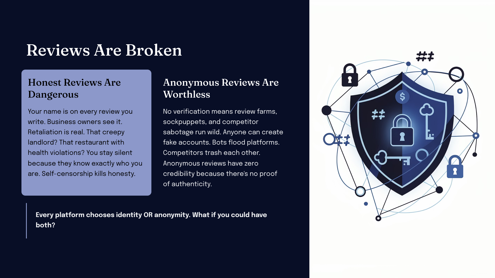
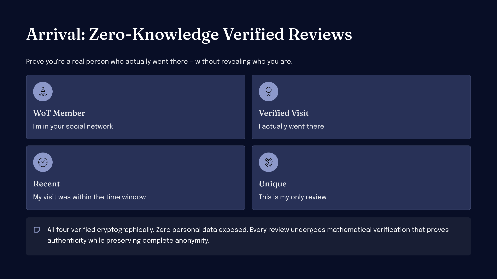
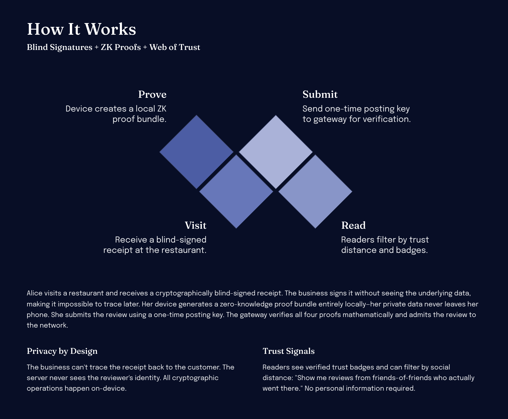
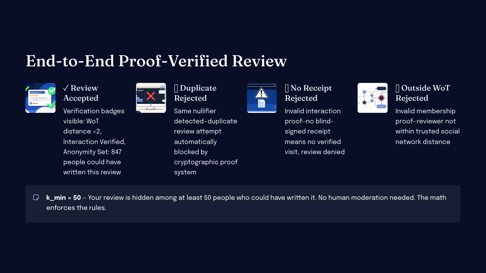
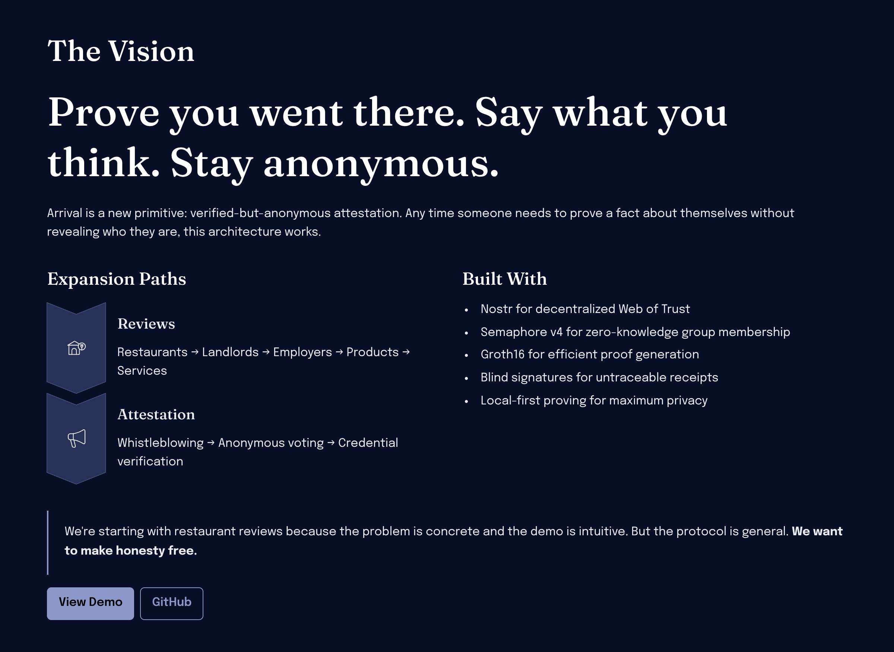

# arrival

The future of reviews: Anonymous, Verifiable, based on your Web of Trust

Reviews are broken. Honest reviewers face retaliation. Fake reviews poison trust. Arrival fixes this with zero-knowledge proofs: leave anonymous, verified reviews that prove you're a real person in the reviewer's social network, who actually visited the business, without revealing who you are.

---

---

## How It Works

Every review must pass four cryptographic checks:

- **WoT Member** — Prove you're in the reader's social network (Nostr + Semaphore v4)
- **Verified Visit** — Prove you actually went there (blind-signed interaction receipts)
- **Recent** — Prove your visit was within the time window (TimeBlind ZK proof)
- **Unique** — Prove this is your only review for this subject/epoch (nullifier)

All private data stays on your device. The server only sees proofs and public inputs.

## Built With

- **Nostr** — Decentralized Web of Trust source
- **Semaphore v4** — ZK group membership + nullifiers
- **Groth16** — Fast verification, small proof size
- **Blind signatures** — Untraceable interaction receipts
- **Local-first proving** — Private data never leaves your device

## Documentation

See [`mvp/`](mvp/) for the full technical specification.
